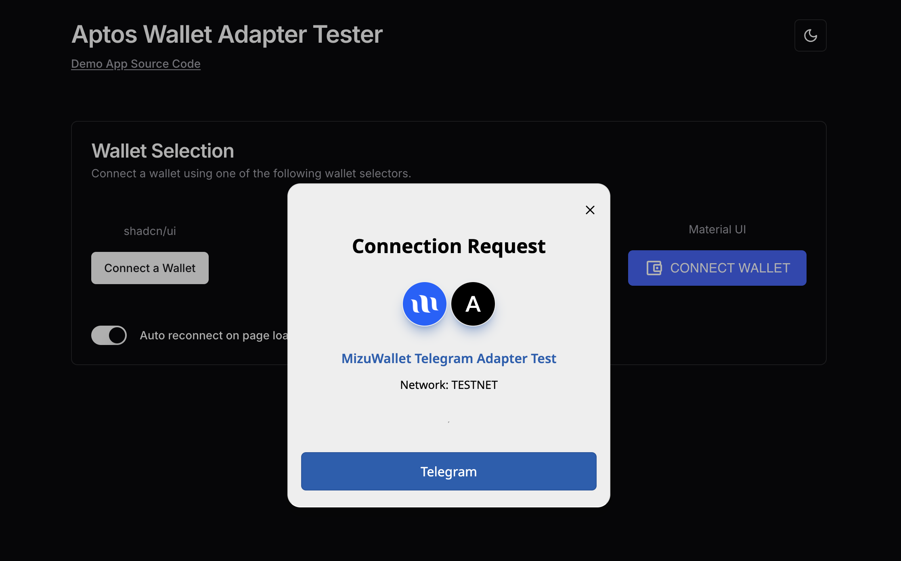

import { Cards, Card } from "nextra/components";

  <Cards num={1}>
    <ShowcaseCard
      title='Aptos Wallet Adapter Tester'
      href='https://aptos-labs.github.io/aptos-wallet-adapter/'
    >
      <></>
    </ShowcaseCard>
    <ShowcaseCard
      title='Aptos Wallet Adapter Tester On Telegram'
      href='https://t.me/MizuWalletAdapterTestBot/MizuWalletAdapterDemo'
    ></ShowcaseCard>
  </Cards>

export const ShowcaseCard = Object.assign(
  // Copy card component and add default props
  Cards.Card.bind(),
  {
    displayName: "ShowcaseCard",
    defaultProps: {
      image: true,
      arrow: true,
      target: "_blank",
    },
  }
);

